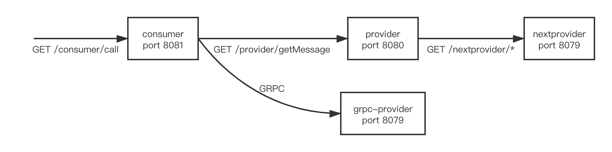

# istio-demo

该项目基于springboot+grpc编码，应用于基于kubernetes+istio平台的一些测试工作（包括istio中的熔断、限流、路由、超时等功能），包含四个子项目`consumer`、`provider`、`nextprovider`、`grpc-provider`，且架构如下：



## 构建

### 编译命令

编译命令可以在总项目下运行进行构建，构建完成后会在各个子项目目录下生成`target/`目录

``mvn clean && mvn -Dmaven.test.skip=true``

### 镜像构建

Dockerfile文件位于各个子项目根目录下（事实上，它们的Dockerfile内容一样），各个子项目构建命令为：

``docker build -f {projectDir}/{subProject}/Dockerfile -t {镜像名}:{标签} {projectDir}/{subProject}``

## 配置

在构建镜像完成后，使用JAVA_OPTS环境变量传递运行参数。

例如使用`-Dspring.config.location={applicationYamlFileUrl}`指定jar包加载外部application.yml配置文件。

### 调用链配置

#### consumer

consumer会调用provider和grpc-provider提供的接口，其上游服务（provider和grpc-provider）地址和端口在consumer子项目下的application.yml文件配置，以便于应用部署在Kubernetes中而不需要硬编码上游服务调用

```
upstream:
  provider:
    serviceAddr: 127.0.0.1
    servicePort: 8080
  grpcProvider:
    serviceAddr: 127.0.0.1
    servicePort: 8888
```

#### provider

与consumer相同，provider调用nextprovider的地址在provider子项目下的application.yml文件中配置

```
upstream:
  nextprovider:
    serviceAddr: 127.0.0.1
    servicePort: 8079
```

## 接口

### consumer

- GET /consumer/call?sleepTime={sleepTime}&code={code}&conCount={conCount}&amount={amount}&user={user} 模拟并发通过HTTP调用provider接口，并将返回数据包装一层字符串返回
  - sleepTime int 必填   睡眠时间，模拟调用处理时长
  - code int 必填             响应码，200则返回成功，其余返回500
  - conCount int 必填    调用并发数
  - amount int 必填       调用次数
  - user string 必填        用户名
- GET /consumer/callgrpc?sleepTime={sleepTime}&code={code}&conCount={conCount}&amount={amount}&user={user} 模拟并发通过GRPC调用grpc-provider接口，并将返回数据包装一层字符串返回
  - sleepTime int 必填   睡眠时间，模拟调用处理时长
  - code int 必填             响应码，200则返回成功，其余返回500
  - conCount int 必填    调用并发数
  - amount int 必填       调用次数
  - user string 必填        用户名

### provider

- POST /provider/getMessage 通过HTTP调用nextprovider接口，并将返回的数据包装一层字符串返回
  - sleepTime int 必填   睡眠时间，模拟调用处理时长
  - code int 必填             响应码，200则返回成功，其余返回500

### nextprovider

- GET /nextprovider/getNumber 返回随机数
- GET /nextprovider/getString 返回`hello, world`字符串

### grpc-provider

返回随机数，grpc通信的proto如下：

```
syntax = "proto3";
package testproto;
option java_package = "com.foxmail.chwetion.istiodemo.grpc.getmessage";
option java_outer_classname = "GetMessageProto";

message GetMessageRequest {
    int32 sleepTime = 1;
    int32 code = 2;
}

message GetMessageResponse {
    string message = 1;
    string code = 2;
}

service GetMessage {
    rpc getMessage(GetMessageRequest) returns (GetMessageResponse);
}
```